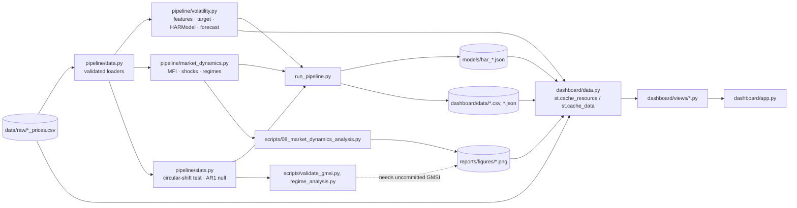
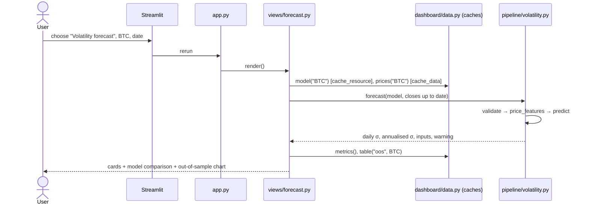
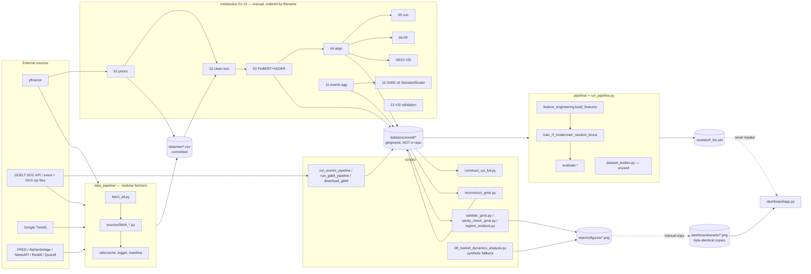

# FinSentinel — Architecture

This document has two parts:
- **Part A** describes the **current** system, after the fixes. It is what you should explain in an interview.
- **Part B** is the forensic audit of the **original** code at commit `e1eb270`. It explains *why* things changed.

---

# Part A — Current architecture

## A1. End-to-end narrative

1. **Raw data**: committed daily prices in `data/raw/{btc,nifty}_prices.csv`, loaded and validated by `pipeline/data.py:25-45` (required columns, unique dates, positive closes).
2. **Features and target**: `pipeline/volatility.py:51-75` turns a close series into trailing features and the target. Every feature uses only data up to day t.
   - Features: log returns, |r|, r², and 5/22/60-day realised vol (raw and log).
   - Target: log std of the next 5 log returns.
3. **Training and evaluation**: `run_pipeline.py:47-114`.
   - Purged walk-forward comparison of HAR, Random Forest, persistence and mean baselines (5 expanding folds, 5-day gap).
   - The final HAR model is then fit on all rows (`pipeline/volatility.py:90-96`) and written as JSON to `models/har_{asset}.json` (L108-111).
4. **Research outputs**, also written by `run_pipeline.py`:
   - MFI and shock propagation on real prices (`pipeline/market_dynamics.py`), saved to `dashboard/data/*.csv` (L99-114).
   - A calibrated null for the published GMSI correlations (`pipeline/stats.py:76-95`), saved to `dashboard/data/gmsi_calibration.json` (L117-145).
5. **Serving**: `dashboard/app.py` routes to one module per page in `dashboard/views/`.
   - All file reads go through `dashboard/data.py`: the model is loaded with `st.cache_resource` (L44-46), prices and tables with `st.cache_data` (L39-62).
   - The forecast page calls `pipeline.volatility.forecast()` (L155-170), the **same** `price_features()` function used in training.

## A2. Components



## A3. Training vs inference: the boundary

```mermaid
flowchart TB
  subgraph TRAIN["TRAINING — offline: python run_pipeline.py (~1 min)"]
    T1[load_close(asset)] --> T2["price_features() → training_frame()<br/>drop NaN rows on used columns only"]
    T2 --> T3["walk-forward: TimeSeriesSplit(5, gap=5)<br/>HAR · RF · persistence · mean"]
    T3 --> T4[metrics.json, oos_*.csv]
    T2 --> T5["HARModel.fit(all rows) → OLS on log σ5, σ22, σ60"]
    T5 --> T6[(models/har_asset.json<br/>intercept + 3 coefs + feature contract)]
  end
  T6 == "boundary: a JSON file with a versioned feature contract<br/>(windows, horizon, feature names checked on load)" ==> I2
  subgraph INFER["INFERENCE — dashboard request"]
    I1[user picks date or pastes closes] --> I0["validate_closes / parse_closes<br/>InputError → friendly st.error"]
    I0 --> I3["price_features(with_target=False) — SAME function"]
    I2["HARModel.from_json (st.cache_resource)"] --> I4
    I3 --> I4["predict_log → exp − 1e-6 → daily σ, ×√365 / √252"]
    I4 --> I5[cards + realised σ if the data has it]
  end
```

**What is baked into the artifact:** the intercept, 3 coefficients, the windows `(5, 22, 60)`, the horizon `5`, and training metadata and metrics. No preprocessing object needs to be serialized, because the features are a deterministic function of the closes. `HARModel.from_json` (`pipeline/volatility.py:113-123`) **refuses** a file whose windows, horizon or feature names differ from the code, which makes train/serve skew a load-time error instead of a silent bug.

**What the caller must provide:** at least 61 strictly positive, finite, consecutive daily closes, oldest first (`pipeline/volatility.py:140-152`).

## A4. Runtime request path



Measured with a real browser (`tests/e2e/browser_smoke.py`, Streamlit 1.63.0, Python 3.11): first paint 2.5–3.8 s, each page 0.6–4.3 s, 0 exceptions, 0 console errors. Before the fix the landing page took 185 s.

## A5. Module table

| File | Responsibility | Key functions | Called by | Calls |
|---|---|---|---|---|
| `pipeline/data.py` | paths, validated price loading | `load_prices` L25, `load_close` L43 | run_pipeline, scripts/08, dashboard/data | pandas |
| `pipeline/volatility.py` | feature/target contract, HAR model, input validation, forecast | `price_features` L51, `training_frame` L72, `HARModel` L78, `parse_closes` L126, `validate_closes` L140, `forecast` L155 | run_pipeline, dashboard, tests | numpy, pandas |
| `pipeline/market_dynamics.py` | MFI, shocks, regimes, within-spell AC1 | `compute_mfi` L33, `identify_shocks` L56, `shock_propagation` L64, `expanding_regimes` L80, `within_spell_ac1` L89 | run_pipeline, scripts/08, regime_analysis | numpy, pandas |
| `pipeline/stats.py` | valid significance tests | `permutation_test` L42, `ar1_null` L76 | run_pipeline, validate_gmsi | scipy |
| `pipeline/sentiment.py` | text cleaning, FinBERT polarity by label name | `clean_text`, `finbert_polarity`, `score_finbert` | notebooks 02/03 | transformers (lazy) |
| `run_pipeline.py` | all offline training and results | `walk_forward` L47, `run_volatility` L80, `run_gmsi_calibration` L117, `run_sentiment_rf` L148 | CLI, CI | pipeline.*, sklearn |
| `dashboard/data.py` | cached file access, missing-artifact errors | `model` L45, `prices` L40, `metrics` L50, `table` L60 | views | pipeline.volatility, pipeline.data |
| `dashboard/views/*.py` | one page each | `render()` | app.py | data, plotly |

## A6. State, seeds, paths, magic numbers (current)
- **Seeds:** RF `random_state=42` (`pipeline/train_rf_model.py:9-10`); all Monte-Carlo code uses `np.random.default_rng(seed)` (`pipeline/stats.py`, `run_pipeline.py:32`). There is no global RNG mutation anywhere.
- **Shared state:** only Streamlit's caches and per-user widget state. No module-level mutable data.
- **Paths:** every path is derived from `Path(__file__).resolve()` (`pipeline/data.py:8-12`, `dashboard/data.py:18`, `scripts/*.py`). Commands work from any CWD.
- **Magic numbers, all named constants with comments:**
  - `HORIZON=5`, `WINDOWS=(5,22,60)`, `EPS=1e-6`, `ANNUALISATION_DAYS` (`pipeline/volatility.py:28-33`)
  - `MFI_WINDOW=30`, `SHOCK_QUANTILE=0.95`, `SHOCK_BURN_IN=250` (`pipeline/market_dynamics.py:22-25`)
  - `PUBLISHED_GMSI_SPEARMAN`, `GMSI_LAG1_ACF=0.82` (`run_pipeline.py:35-36`): inputs taken from the original analysis, because the GMSI series is not committed

---

# Part B — Audit of the original code (commit `e1eb270`)

> Scope: the repository at commit `e1eb270` (2026-03-23), read end to end. Line numbers refer to that commit (`git show e1eb270:<path>`). Every claim cites `file:line` (or `notebook cell N`).

## 0. The one-paragraph truth

FinSentinel is **three loosely-coupled, mostly offline research tracks plus a static dashboard**, not an end-to-end ML system:

1. **Data collection**: a modular fetcher package (`data_pipeline/`) plus ad-hoc notebooks and scripts that download prices (yfinance), headlines (GDELT DOC API), and GDELT event files.
2. **Research analyses**, run by hand in notebooks and scripts:
   - a sentiment→volatility Random Forest (abandoned)
   - a "VSI" index (abandoned, because it contained volatility itself)
   - an exogenous stress index, GMSI, with conditional-expectation and placebo tests
   - a fragility/shock analysis, MFI. **Its committed outputs were produced by its synthetic-data fallback.**
3. **A Streamlit dashboard** (`dashboard/app.py`) that shows **PNG figures, hard-coded numbers, and freshly simulated GARCH/AR(1) data**.

**The dashboard loads no model, reads no data file, and calls no pipeline code.** The serialized model `models/rf_btc.pkl` is never loaded by anything in the repo, and it is a constant predictor (§6).

---

## 1. End-to-end narrative (what really happens, step by step)

### 1a. Track A: sentiment-augmented volatility forecasting (Dec 2025 – Jan 2026, abandoned)

| Step | Where | What it does |
|---|---|---|
| 1 | `notebooks/01_data_collection.ipynb` cell 3 | `yf.download` BTC-USD (2015→) and ^NSEI (2010→). Writes `data/raw/{btc,nifty}_prices.csv` with a **simple** return `close.pct_change()`. |
| 2 | `notebooks/01a_text_data_collection.ipynb` cells 4-11 | GDELT DOC API headline titles. The committed run only fetched 2015-01-01→01-02, which returned empty. The committed `data/raw/text_data.csv` (1,500 headlines, 2024-10-03 → 2025-01-01) came from an earlier run that is not in the notebook. |
| 3 | `notebooks/02_preprocessing.ipynb` cells 3-5 | `clean_text`: lowercase, strip URLs, **delete every non-`[a-zA-Z\s]` character**, keep if length > 10 → 1,377 rows → `data/processed/text_preprocessed.csv`. |
| 4 | `notebooks/03_sentiment_analysis.ipynb` cells 3-6 | FinBERT (`ProsusAI/finbert`) score = `probs[2] - probs[0]`; VADER compound. **Label-order bug, see ISSUES P0-3.** |
| 5 | `notebooks/04_time_alignment.ipynb` cells 3-11 | Log returns, daily mean sentiment per UTC date per asset, inner join on date, lags 1/2/3/5 → `btc_sentiment_aligned.csv` (75 rows) and `nifty_sentiment_aligned.csv` (54 rows), per `notebooks/05_correlation_analysis.ipynb` cell 3 output. |
| 6 | `run_pipeline.py:9-24` → `pipeline/feature_engineering.py:3-56` → `pipeline/train_rf_model.py:7-35` | Builds 9 features plus target `log(std(r[t+1..t+5]) + 1e-6)`, does an 80/20 chronological split, fits `RandomForestRegressor`, and dumps `models/rf_btc.pkl`. With 75 input rows, only about 11 rows survive `dropna`, so every tree is a single leaf (§6). |
| 6' | `notebooks/06_rf_volatility_forecasting.ipynb` | Same idea with 12 features and a 1-step target. Prints `len(btc_df) = 15` (cell 3) and **all feature importances = 0.0** (cell 7). |
| 6'' | `notebooks/07_sentiment_augmented_volatality_NIFTY.ipynb` cell 4 | CNN on NIFTY. **Crashes**: `Found array with 0 sample(s)`. |

### 1b. Track B: VSI → GMSI (Jan 2026 – Mar 2026)

| Step | Where | What it does |
|---|---|---|
| 1 | `scripts/run_events_pipeline.py:96-172`, `scripts/run_gdelt_pipeline.py:101-155` | Download daily GDELT 1.0 event / GKG zip files and filter them by root code, country, and keywords. Output is gitignored and **not in the repo**. |
| 2 | `notebooks/11_event_detection_and_labeling.ipynb` cells 14-19 | Aggregate the events into a daily `events_daily_2015_2025.csv` (3,998 days): `event_count`, `avg_goldstein`, `neg_event_share`, and `conflict/economic/political_events`. **The last three are all 0** (cell 20 `describe()` shows mean 0.0) because a string-vs-int comparison never matches (ISSUES P1-6). |
| 3 | `scripts/construct_vsi_full.py:5-176` | VSI = mean of z(vol_30d), z(sentiment), z(attention). It contains volatility itself, and `notebooks/13_gmsi_validation.ipynb` cell 17 reports corr(VSI, vol) = 0.92 for BTC and 0.96 for NIFTY. This is the "mechanical coupling" the README mentions. |
| 4 | `scripts/reconstruct_gmsi.py:9-95` | **"Pure exogenous" GMSI** = equal-weight mean of 6 expanding z-scores (event count, negative share, −Goldstein, −sentiment, −sentiment surprise, attention), with `fillna(0)` (L65). Sentiment exists for only about 82 days, so 3 of the 6 components are 0 on roughly 98% of days. → `gmsi_exogenous.csv` (not in repo). |
| 5 | `scripts/validate_gmsi.py:8-105`, `scripts/sanity_check_gmsi.py`, `scripts/regime_analysis.py` | Spearman GMSI(t) vs forward vol, quintile conditional means, KS/MWU tests, a **1000-shuffle i.i.d. placebo**, and regime stats. These produce the real-data figures `cond_exp_*`, `placebo_test_*`, `gmsi_sanity_checks`, and `regime/*`. |

### 1c. Track C: MFI / shock propagation ("Paper 2")

| Step | Where | What it does |
|---|---|---|
| 1 | `scripts/08_market_dynamics_analysis.py:72-112` | Looks for `data/processed/btc_features.csv`, `nifty_features.csv`, and `gmsi_daily.csv`. **No code in the repo writes any of these three files** (grep: they appear only in this script and its notebook copy). |
| 2 | `scripts/08_market_dynamics_analysis.py:855-857` | Files missing → `generate_synthetic_data()` (L162-198): GARCH(1,1) t-innovations for BTC and NIFTY, plus an AR(1) "GMSI", all from `np.random.seed(42)` (L39). |
| 3 | L203-436 | MFI, shocks, regimes, and regime stats run on the synthetic data → `fig1/3/4/5/6_*.png`. |
| 4 | — | Those PNGs were copied to `reports/figures/` and `dashboard/assets/`, and their numbers were typed into `dashboard/app.py:393-404`. **Proven identical** by `analysis/verify_dashboard_numbers.py` (DATA_REPORT §9, MODEL_REPORT §7). |

### 1d. The dashboard at runtime

`streamlit run dashboard/app.py` runs top to bottom on every interaction:

1. `st.set_page_config` (`app.py:19-24`).
2. A 335-line CSS string is injected (`app.py:36-372`).
3. Module-level constants are defined (`app.py:379-404`): conditional expectations, correlations, regime stats, shock decay.
4. `gen_market_data()` (`app.py:409-447`, `@st.cache_data`) simulates 2,000 business days of GARCH returns for "BTC" and "NIFTY" plus an AR(1) "GMSI", with `np.random.seed(42)`.
5. A sidebar of 7 `st.button`s sets `st.session_state.page` and calls `st.rerun()` (`app.py:561-576`).
6. One `if/elif` branch renders the chosen page (`app.py:626-1322`) from `load_img(...)` PNGs (`app.py:29-33`), the constants, and the simulated `mdf`.

There is **no preprocessing, no model, and no user input that reaches any computation**, apart from two radio buttons that select which hard-coded dict to plot (`app.py:837-840`).

---

## 2. Component diagram



---

## 3. Runtime request path (what happens when a user clicks)

```mermaid
sequenceDiagram
  actor U as User (browser)
  participant ST as Streamlit server
  participant APP as dashboard/app.py (re-executed top→bottom)
  participant C as st.cache_data
  participant FS as dashboard/assets/*.png

  U->>ST: click sidebar button "Shock Propagation"
  ST->>APP: rerun script with widget state
  APP->>APP: set_page_config, inject CSS, define constants (L379-404)
  APP->>C: gen_market_data()
  C-->>APP: cached synthetic DataFrame (1,971 rows)
  APP->>APP: button handler sets session_state.page="shock"; st.rerun() (L575-576)
  ST->>APP: rerun again
  APP->>FS: PIL.Image.open(fig6_shock_decay_comparison.png)  (L1047)
  APP->>APP: plot SHOCK_DECAY constants with Plotly (L1059-1067)
  APP-->>ST: delta messages (markdown, images, plotly JSON)
  ST-->>U: rendered page
  Note over APP: No preprocessing. No model. No data file read.<br/>Nothing the user enters reaches any computation.
```

**Measured cost** (`streamlit.testing.v1.AppTest`, Streamlit 1.40.0, Python 3.11.17, this sandbox):
- `overview` takes **185.2 s** to render.
- `regime` takes **31.4 s**.
- Every other page takes under 1 s.

**Root cause:** one plotly `add_vrect(row=…, col=…)` call per regime segment (`app.py:668-675` and `1167-1172`). That is 620 calls on a 2-row subplot that already contains 1,971-point traces, and each call re-scans the figure, so the cost grows quadratically. The same 620 shapes on an empty figure took 0.2 s. See ISSUES P2-1.

---

## 4. Training pipeline vs inference pipeline: the boundary

**The boundary is the pickle file, and nothing ever crosses it.** Training writes `models/rf_btc.pkl`. No code reads it: `grep -rn "rf_btc\|joblib.load\|pickle.load" --include=*.py --include=*.ipynb` returns zero hits outside `analysis/`. The only reference to the file is the `joblib.dump` at `pipeline/train_rf_model.py:33`. The "inference pipeline" a candidate might describe does not exist.

```mermaid
flowchart TB
  subgraph TRAIN["TRAINING (offline, run once by hand: python run_pipeline.py)"]
    A1[data/processed/btc_sentiment_aligned.csv<br/>75 rows, 2024-10-08 → 2024-12/2025-01<br/>NOT committed] --> A2["build_features()<br/>pipeline/feature_engineering.py:3-56<br/>rolling 5/22/60 · surprise · interactions<br/>target = log(std r[t+1..t+5] + 1e-6)<br/>dropna → ~11 rows"]
    A2 --> A3["train_test_split(test_size=0.2, shuffle=False)<br/>run_pipeline.py:15-17"]
    A3 --> A4["RandomForestRegressor(600 trees, depth 8,<br/>min_samples_leaf=10, sqrt, rs=42)<br/>pipeline/train_rf_model.py:8-17"]
    A4 --> A5["RMSE/MAE on exp(pred) vs exp(y)  (L20-28)"]
    A4 --> A6[(models/rf_btc.pkl)]
  end

  A6 -. "boundary: NOTHING loads this file" .-x I0

  subgraph INFER["'INFERENCE' AS IMPLEMENTED (dashboard/app.py)"]
    I0[user click] --> I1[hard-coded dicts L379-404]
    I0 --> I2[PNG files from dashboard/assets]
    I0 --> I3["gen_market_data(): np.random.seed(42) GARCH + AR(1) (L409-447)"]
    I1 & I2 & I3 --> I4[Plotly / st.image]
  end

  subgraph WOULD["What an inference path WOULD need (does not exist)"]
    W1[latest ≥60 daily closes + same-day headlines] --> W2[clean_text → FinBERT (fixed label order) → VADER]
    W2 --> W3[daily mean per asset → build_features identical to training]
    W3 --> W4[model.predict → exp(·) − 1e-6 → 5-day σ of daily log returns]
  end
```

---

## 5. Module-by-module table

| File | Responsibility | Key functions / objects | Called by | Calls |
|---|---|---|---|---|
| `run_pipeline.py` | Train the BTC RF from `data/processed/btc_sentiment_aligned.csv` | `run(asset)` L9-24 | CLI `python run_pipeline.py` (L27-28) | `build_features`, `train_random_forest`, `feature_importance`, `plot_predictions`, sklearn `train_test_split` |
| `pipeline/feature_engineering.py` | Features + target | `build_features(df, target_horizon=5)` L3-56 | `run_pipeline.py:13` | pandas/numpy only |
| `pipeline/train_rf_model.py` | Fit, score, pickle | `train_random_forest(...)` L7-35 | `run_pipeline.py:19` | sklearn RF, `joblib.dump` L33 |
| `pipeline/evaluate.py` | Importance print + plot | `plot_predictions` L5-14, `feature_importance` L17-26 | `run_pipeline.py:23-24` | matplotlib |
| `pipeline/dataset_builder.py` | Alternative split helper | `build_dataset` L18-24 | **nobody** (dead). It also references `TARGET="log_vol"` (L16) and `vol_5/vol_22/vol_60/sent_vol`, which `build_features` never returns. | sklearn |
| `data_pipeline/fetch_all.py` | Orchestrate 8 fetchers, write manifest | `run_source` L92-109 (dynamic import), `run_pipeline` L137-178, `main` L183-197 | CLI | `sources.*`, `utils.*` |
| `data_pipeline/sources/fetch_yfinance.py` | 17 tickers OHLCV + log return + vols ×√252 | `_download_ticker` L83-137, `fetch_yfinance` L144-196 | fetch_all | yfinance, cache, manifest |
| `…/fetch_fred.py` | 15 FRED series | `fetch_fred` L77-157 | fetch_all | fredapi |
| `…/fetch_gdelt.py` | GKG daily aggregates via BigQuery | `_MONTH_QUERY` L50-74, `fetch_gdelt` L99-197 | fetch_all | google-cloud-bigquery |
| `…/fetch_trends.py` | 14 Google Trends terms | `fetch_trends` L100-189 | fetch_all | pytrends |
| `…/fetch_alphavantage.py`, `fetch_reddit.py`, `fetch_newsapi.py`, `fetch_quandl.py` | Other sources | `fetch_*` | fetch_all | requests / praw / quandl |
| `data_pipeline/utils/cache.py` | 24 h file-age cache | `is_cache_valid` L19-39 | all fetchers | — |
| `data_pipeline/utils/logger.py` | Logger to `data/raw/pipeline.log` | `get_logger` L54-57 | all | logging |
| `data_pipeline/utils/manifest.py` | `data/raw/manifest.json` | `build_record` L37-88, `write_manifest` L91-107 | all | json |
| `scripts/run_events_pipeline.py` | Download + filter GDELT events, 2025-05-30→2025-12-31 | module-level loop L96-172 | manual | requests |
| `scripts/run_gdelt_pipeline.py` | Download + keyword-filter GKG, 2020-03-17→2025-12-31 | module-level loop L101-155 | manual | requests |
| `scripts/download_gdelt.py`, `filter_gdelt_events.py` | Quarterly GDELT zips, column subset | `download_quarter`, `filter_daily_file` | **nobody** (functions defined, never invoked) | — |
| `scripts/construct_vsi_full.py` | VSI (contains vol) | `create_vsi_dataset` L5-176 | manual `__main__` | pandas |
| `scripts/reconstruct_gmsi.py` | Exogenous GMSI | `expanding_z_score` L4-7, `reconstruct_gmsi` L9-95 | manual | pandas |
| `scripts/validate_gmsi.py` | Lagged Spearman, quintiles, KS/MWU, placebo | `validate_asset` L8-105 | manual | scipy, seaborn |
| `scripts/sanity_check_gmsi.py` | ADF, same-day corr, 4-panel figure | `sanity_check` L9-73 | manual | statsmodels |
| `scripts/regime_analysis.py` | Regimes (full-sample quantiles), diagnostics, shocks | `assign_regimes` L21-41, `shock_response` L98-141 | manual | scipy, statsmodels |
| `scripts/08_market_dynamics_analysis.py` | MFI, shocks, regimes, **synthetic fallback** | `load_or_generate_data` L72-112, `generate_synthetic_data` L162-198, `compute_mfi` L203-278, `identify_shocks` L283-294, `define_regimes` L377-401 | manual (+ verbatim copy in `notebooks/08_market_dynamics_analysis.ipynb`, never executed) | scipy, matplotlib |
| `scripts/data_check.py` | Print shapes of processed files | module-level | manual | pandas |
| `dashboard/app.py` | The whole UI | `load_img` L29-33, `gen_market_data` L409-447, `t()` L466-478, `page_header` L610-620, page branches L626-1322 | Streamlit | streamlit, plotly, PIL, numpy, pandas |
| `src/*.py`, `docs/methodology.md`, `Untitled.ipynb` | Empty placeholders (0 lines / 0 cells) | — | — | — |

---

## 6. Contract of the serialized artifact `models/rf_btc.pkl`

Verified by loading it with scikit-learn 1.8.0 (`analysis/model_eval.py` §A, output in `analysis/outputs/model_eval_stdout.txt`):

| Property | Value |
|---|---|
| Object | bare `sklearn.ensemble.RandomForestRegressor`. **Not** a `Pipeline`: no scaler, imputer, or encoder is baked in. |
| Pickled with | scikit-learn **1.8.0** (`_sklearn_version` in the pickle bytes), numpy 2.x (`numpy._core` module path) |
| Size | 232,081 bytes |
| Params | `n_estimators=600, max_depth=8, min_samples_leaf=10, max_features='sqrt', random_state=42, bootstrap=True, criterion='squared_error'` |
| `feature_names_in_` (order matters) | `finbert_score, vader_score, finbert_surprise, vader_surprise, abs_return, sq_return, sent_x_vol5, sent_x_vol22, sent_x_absret` |
| Output | `log(σ + 1e-6)`, where σ = sample std of **daily log returns over t+1…t+5** (not annualised). The caller must apply `exp(pred) − 1e-6`. |
| What the caller must compute by hand | everything: log returns, `rolling(5)` sentiment means for surprises, `vol_5`/`vol_22` for interactions, FinBERT with the *same* (buggy) `probs[2]-probs[0]` mapping |
| **Actual behaviour** | **All 600 trees have depth 0 (a single leaf). All 9 feature importances are 0.0.** For 1,000 random inputs it returns exactly one value, **−3.7299327 → σ = 0.02399** (≈2.4% daily). It is a constant: functionally `DummyRegressor(strategy="mean")` with bootstrap noise. |
| Why | Bootstrap sample sizes at the root are 2–8 distinct rows. A split needs ≥ `2 × min_samples_leaf` = 20 rows. |
| Loaded by | **nothing** |

---

## 7. Global / shared state, seeds, hard-coded paths, magic numbers

### 7a. Global and shared state
- `dashboard/app.py:16` and `scripts/08_market_dynamics_analysis.py:38`: `warnings.filterwarnings("ignore")` hides every warning, including the Plotly/Streamlit deprecations.
- `dashboard/app.py:411`: `np.random.seed(42)` inside a cached function mutates the **process-global** NumPy RNG.
- `dashboard/app.py:945`: `np.random.seed(99)` runs on every render of the placebo page, inside the shared server process.
- `dashboard/app.py:449`: `mdf` is a module-level DataFrame shared by every page.
- `st.session_state.page` (`app.py:498-500`) is the only per-user state.
- `data_pipeline/utils/logger.py:22`: `_root_logger_configured` is a module global.
- `data_pipeline/fetch_all.py:35`: `sys.path.insert(0, …)` mutates the import path.

### 7b. Random seeds: where they are and aren't

| Place | Seed |
|---|---|
| RF `pipeline/train_rf_model.py:13`, `notebooks/06` cell 5 | `random_state=42` ✔ |
| `scripts/validate_gmsi.py:79` | `np.random.seed(42)` ✔ (global) |
| `scripts/08_market_dynamics_analysis.py:39` | `np.random.seed(42)` at import ✔. This seed is *why the synthetic figures are exactly reproducible*. |
| `notebooks/13` cell 17 | `np.random.seed(42)` ✔ |
| KMeans `notebooks/08_graphs_and_plots` cell 14, `notebooks/12` cell 16 | `random_state=42` ✔ |
| `notebooks/09_VSI_Long_v2` cell 34 `sklearn.utils.resample(df)` | **unseeded** ✘ |
| `notebooks/10_vsi_variants` cell 13 `sample(frac=1, replace=True)` | **unseeded** ✘ |
| `dashboard/app.py:411, 945` | 42 and 99 (synthetic data and a fake null distribution) |

### 7c. Hard-coded / CWD-dependent paths
- **CWD = repo root assumed:**
  - `run_pipeline.py:10` (`data/processed/...`)
  - `pipeline/train_rf_model.py:30` (`Path("models")`)
  - `scripts/reconstruct_gmsi.py:13,17,25,90`
  - `scripts/validate_gmsi.py:58,105,108-120`
  - `scripts/regime_analysis.py:10-16`
  - `scripts/sanity_check_gmsi.py:11-17,47,72`
  - `scripts/construct_vsi_full.py:182-195`
  - `scripts/data_check.py:16-20`
- **CWD = `scripts/` assumed (`../data/...`):** `scripts/download_gdelt.py:7`, `filter_gdelt_events.py:4-5`, `run_events_pipeline.py:14-15`, `run_gdelt_pipeline.py:17-18`. These contradict the line above: the two script families cannot be run from the same directory.
- **CWD = `notebooks/` assumed:** every notebook uses `../data/...`, except `01a`, which writes `data/raw` relative to `notebooks/` (cell 2). So `notebooks/data/raw/` exists in `.gitignore:32`.
- **Script-relative (correct):** `dashboard/app.py:27` (`os.path.dirname(__file__)`) and all `data_pipeline/*` (`Path(__file__).resolve().parents[2]`).
- **Absolute Windows paths** in committed reports: `reports/exogenous_vsi_v1_results` (`e:/financial-sentiment-research-project/...`) and `reports/regimes_vsi_results` (`C:/Users/Dell/.gemini/antigravity/brain/.../*.png`).
- **Hard-coded date windows:**
  - `data_pipeline/sources/fetch_trends.py:59` `TIMEFRAME = "2010-01-01 2026-03-21"`
  - `scripts/run_events_pipeline.py:11-12`, `scripts/run_gdelt_pipeline.py:13-14`
  - `notebooks/01_data_collection` cell 2 `END_DATE = "2025-12-31"`

### 7d. Magic numbers (and what they encode)

| Value | Where | Meaning / problem |
|---|---|---|
| `1e-6` | `feature_engineering.py:21` | log floor; daily σ is ~0.01–0.1, so harmless |
| `5, 22, 60` | `feature_engineering.py:15-17` | ~1 week / 1 month / 1 quarter of *trading* days, also applied to 7-day-a-week BTC |
| `target_horizon=5` | `feature_engineering.py:3,20` | target window t+1..t+5. The comment on L19 says "next-day volatility", which is wrong. |
| `600, 8, 10, "sqrt", 42` | `train_rf_model.py:9-13` | RF hyperparameters, never tuned (no search code exists anywhere) |
| `0.2` | `run_pipeline.py:16` | test fraction |
| `√252` | `fetch_yfinance.py:78`, `08_…py:152-154, 884-887`, `notebooks/09` cell 16 | annualisation using equity trading days. **Also applied to BTC, which trades 365 days a year.** `notebooks/13` cell 3 uses `√365`. Inconsistent. |
| `0.20 / 0.80` | `regime_analysis.py:28-29`, `08_…py:377`, `app.py:437-438` | regime cut-offs |
| `0.95` | `08_…py:283`, `regime_analysis.py:106`, `validate_gmsi.py:63` | "shock" / "tail" definition |
| `30` | `08_…py:203` (MFI window), `reconstruct_gmsi.py:4,37` (z-score `min_periods`, surprise window) | — |
| `0.7 / 0.3` | `08_…py:463-464` | MFI "high/low fragility" lines; arbitrary |
| `0.6 / 0.4`, `0.7 / 0.3` | `notebooks/09` cell 6, `notebooks/10` cell 3 | FinBERT/VADER blend weights, chosen by hand |
| `1000` vs **`500`** | `validate_gmsi.py:78` vs README L52, `app.py:635,710,890` | placebo permutations: the code does 1000, the docs say 500 |
